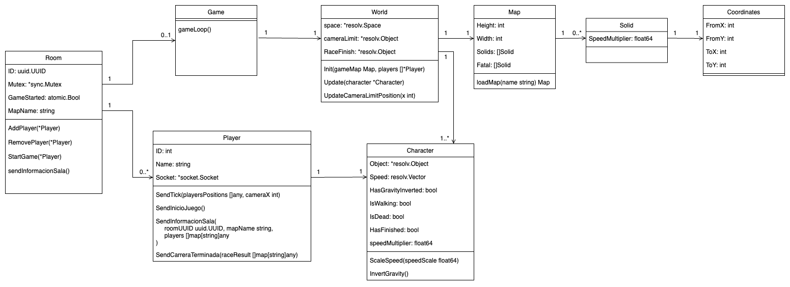

# El pibe gravedad

## Juego

Versión en línea de Gravity Guy, donde los jugadores usan un único botón para cambiar la gravedad. En este juego multijugador, todos compiten en la misma pista visible en la pantalla. El objetivo es evitar obstáculos y no caer fuera del escenario, ya que los jugadores que
se quedan atrapados o caen son eliminados. El ganador sera el ultimo jugador que permanezca en la pista o el primero en llegar al final de la misma.

Una pista puede contar con diferentes desafíos, como áreas sin suelo, escalones, plataformas móviles y otros obstáculos que dificulten la carrera. Los jugadores también podrán chocar entre sí, añadiendo una capa extra de dificultad y estrategia.


Trailer del juego original: [Gravity Guy Trailer](https://www.youtube.com/watch?v=iVTqXnJAotQ&ab_channel=Miniclip).

Aunque el juego original ofrece un modo multijugador ("Multiplayer Mode" en el video), el mismo solo funcionaba de forma local, asignando a los distintos jugadores distintas teclas para realizar los movimientos. Por lo tanto, nuestro objetivo principal sera crear este modo de forma online en tiempo real ademas de darle al juego un estilo visual propio.

## Documentacion tecnica

El proyecto esta dividido en dos componentes principales:

1. El cliente web encargado de mostrar los jugadores la interfaz grafica para jugar.
2. El servidor encargado de la logica del juego y la comunicacion entre los distintos clientes.

Para asegurar que todos los jugadores estén sincronizados en tiempo real, el servidor tendrá dos
tareas clave. Primero, se encargará de la lógica de envío y recepción de mensajes entre los clientes,
así como del "motor" del juego que realiza los cálculos de la posición de cada jugador en cada tick.
Planeamos que haya 30 ticks por segundo para mantener el juego fluido.

El cliente, por su parte, recibirá del servidor la posición de la cámara y será responsable de renderizar
el mundo visible en esa área. La cámara se moverá a una velocidad constante, pero el servidor
enviará continuamente la posición de la cámara para evitar descoordinación entre los distintos
clientes y garantizar que todos vean el mismo escenario en tiempo real.

Además del juego en sí, necesitaremos desarrollar toda la lógica para gestionar la experiencia
multijugador. Esto incluye la creación de salas donde los jugadores puedan reunirse, el sistema de
invitaciones para que los amigos puedan unirse a partidas, y la gestión de la entrada y salida de los
jugadores en las partidas. También será importante implementar un sistema para iniciar y finalizar las
partidas, asegurando que todo funcione de manera fluida y sin interrupciones.

## Cliente

Servidor escrito en Golang para el juego "El pibe gravedad".

### Ejecucion local

La ejecucion local del proyecto es necesario tener instalado `npn` `node.js` y `lint`:

1. Instalar:

    ```bash
    cd cliente
    npm install
    ```

2. Ejecutar
    npm run dev


Para detalles sobre el cliente visita [esta pagina](cliente/README.md).

## Server

Servidor escrito en Golang para el juego "El pibe gravedad".

### Ejecucion local con docker (recomendado)

La ejecucion local del proyecto es utilizando `docker`:

1. Instala docker y el plugin compose:

    1. En Mac:

        1. Ingresa a la pagina <https://docs.docker.com/desktop/setup/install/mac-install/> para descargar Docker Desktop.
        2. Ejecuta el instalador Docker.dmg y sigue las instrucciones
        3. Ejecuta Docker Desktop
2. Ingresa al directorio del servidor

    ```bash
    cd server/
    ```

3. Ejecuta

    ```bash
    docker compose up
    ```

### Ejecucion local directa con go

Tambien es posible ejecutar el servidor de forma local directamente usando `go`:

1. Instala go>1.23.1
   1. En mac:
      1. Descarga el instalador desde <https://go.dev/dl/>.
      2. Ejecuta el instalador y sigue las instrucciones.
2. Ingresa al directorio del servidor

    ```bash
    cd server/
    ```

3. Ejecuta

    ```bash
    go run .
    ```

### Diagrama de clases

El codigo del servidor esta compuesto por las siguientes entidades y relaciones:



(cabe aclarar que Go no es un lenguaje orientado a objetos, por lo que estas entidades son conceptuales y algunas estan realmente desarrolladas usando un `struct` con metodos o directamente funciones dentro de un paquete)

- [Room](server/room.go): Representa una sala a la que los jugadores se usen para jugar una partida de **El pibe gravedad**. Está identificada por un `ID` y para jugar el mapa llamado `MapName`. Tiene un `Mutex` para dar sincronizacion entre los ticks y las modificaciones que pueden hacer los jugadores (por ejemplo el cambio de gravedad). Su propiedad `GameStarted` permite determinar si el juego ya ha comenzado en esta sala, para evitar ingreso de nuevos jugadores. A la sala se pueden agregar y remover jugadores (`AddPlayer` y `RemovePlayer`), comenzar el juego (`StartGame`) y enviar a todos los jugadores la informacion de la misma (`sendInformacionSala`).
- [Player](server/player.go): Representa a un jugador que se unió a una sala para jugar. Está identificado por un `ID` y cuenta con un nombre (`Name`). Su propiedad `Socket` es lo que permite recibir y enviar mensajes a ese jugador en especifico: la información de cada tick (`SendTick`), la notificación de que inició el juego (`SendInicioJuego`), la información de la sala (`SendInformacionSala`) y la notificación de la carrera terminó (`SendCarreraTerminada`).
- [Game](server/game.go): Representa el juego siendo desarrollado en una sala. Es donde se encuentra la logica de los ticks (`gameLoop`), en donde a cada tick se actuliza la partida y se envian los mensajes correspondientes a los jugadores.
- [World](server/world.go): Representa el mundo en el juego tiene lugar. Esta entidad contiene los objetos que se mueven, interactuan y colisionan en el juego: personajes (`Character`), objetos del mapa (`Map`), limites del mundo (utilizados para determinar cuando un jugador muere por hacer contacto con ellos), limite de la camara (`cameraLimit`, utilizado para determinar cuando un jugador muere por quedar demaciado atras) y meta de la carrera (`RaceFinish`, utilizado para determina cuando un jugador pasó la meta).

  La logica de espacio, posiciones, velocidades y colisiones se realiza utilizando la librería [resolv](http://github.com/solarlune/resolv), siendo toda esta informacion incluida en su propiedad `space`. Su metodo `Init` inicializa este espacio con los personajes y los objetos del mapa. El metodo `Update` es el metodo que es llamado desde el `Game` en cada tick para que se actulice a un personaje: su posicion, sus colisiones y su estado en base a ellas (caminando, muerto, etc.). Ademas, en base al avance de los jugadores, el `Game` determina la nueva posición de la camara, por lo que el metodo `UpdateCameraLimitPosition` actualiza la posicion del objeto que representa el limite de la camara en el mundo.
- [Character](server/character.go): Representa a un personaje, es decir, un jugador (`Player`) dentro del mundo (`World`). El mismo esta compuesto por un objeto (`Object`) y una velocidad (`Speed`) dentro del mundo. A su vez, jugada el estado del personaje en la partida: si tiene la gravedad invertida (`HasGravityInverted`, es decir, si el personaje cae hacia arriba en lugar de hacia abajo), si esta caminando (`IsWalking`, es decir, si está haciendo contacto con el piso), si esta muerto (`IsDead`), si ya ha terminado la carrera (`HasFinished`, es decir, si pasó la meta) y su multiplicador de velocidad (`speedMultiplier`, dada por el multiplicador del solido con el que este haciendo contacto). Los personajes pueden aumentar su velocidad (`ScaleSpeed`) e invertir su gravedad (`InvertGravity`).
- [Map](server/map.go): Contiene toda la información que es leida desde el archivo `json` que luego se utiliza para crear el mundo: el alto (`Height`), el ancho (`Width`), las plataformas y obstaculos (`Solids`), los obstaculos mortales (`Fatals`), la posicion de inicio de los jugadores (`PlayersStart`) y la posicion de la meta (`RaceFinish`). Su metodo `loadMap` carga toda esta infromación desde el archivo `json`.
- [Solid](server/map.go): Representa cada uno de los objetos solidos (no personajes) que el mapa contiene y deben ser creados en el mundo. Estan compuestos por sus coordanadas en el mapa y el multiplicador de velocidad que otorgan a los personajes al entrar en contacto con ellos (`SpeedMultiplier`).
- [Coordinates](server/coordinates.go): Representa un conjunto de coordenadas donde un solido debe ser posicionado en el mundo.

Además, el servidor cuenta con otros dos archivos clave para su funcionamiento:

- [main.go](server/main.go): Punto de entrada de la ejecución del servidor, donde se inicializa el servidor `http` que estable las conexiones con los clientes y crea los web-sockets.
- [client.go](server/client.go): Archivo donde se encuentran los pasos a seguir para cada uno de los mensajes que son posibles recibir de parte de un cliente:
  - Conexión: crear entidad `Player` que permitirá enviar mensajes a este cliente.
  - Desconexión: remover jugador de la sala (si está en alguna) (`RemovePlayer`) y eliminar la entidad `Player`.
  - Mensaje `crearSala`: crear una entidad `Room`, agregar nueva sala a la lista de salas disponibles y agregar al jugador a esta sala (`AddPlayer`).
  - Mensaje `unirSala`: buscar la sala en la lista de salas disponibles, sacar al jugador de su sala anterior (si estuviera en alguna) (`RemovePlayer`), agregar al jugador a esta sala (`AddPlayer`) y enviar a todos los jugadores de la sala la información de la sala actualizada (`sendInformacionSala`).
  - Mensaje `iniciarJuego`: verificar que el juego no esté ya iniciado y, de lo contrario, iniciar el juego en la sala (`StartGame`).
  - Mensaje `changeGravity`: verificar que el jugador esté en una sala que tiene un juego comenzado y, de ser así, invertir la gravedad de su personaje (`InvertGravity`).
