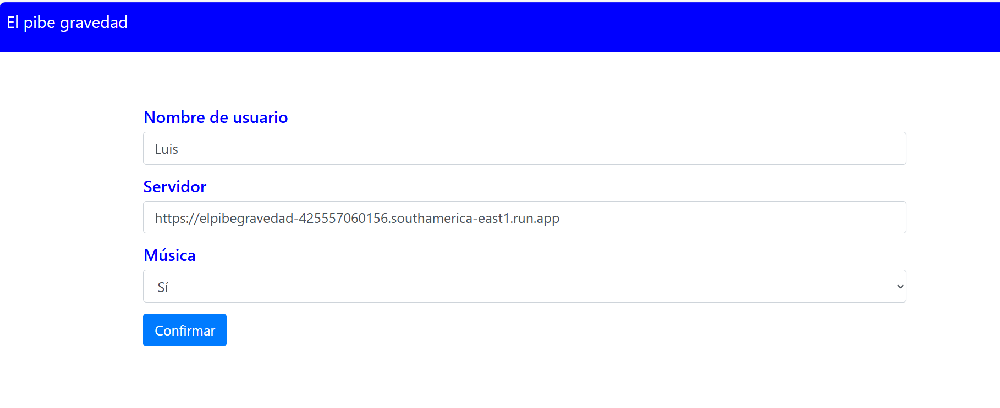
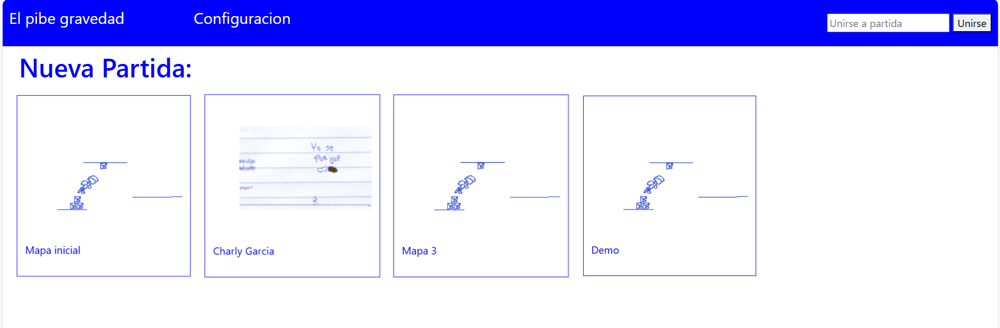
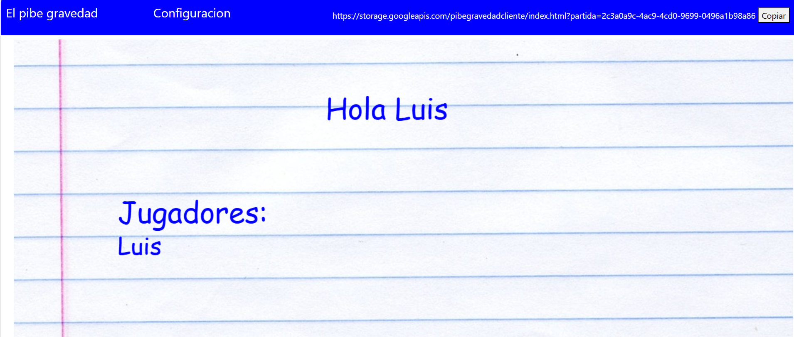
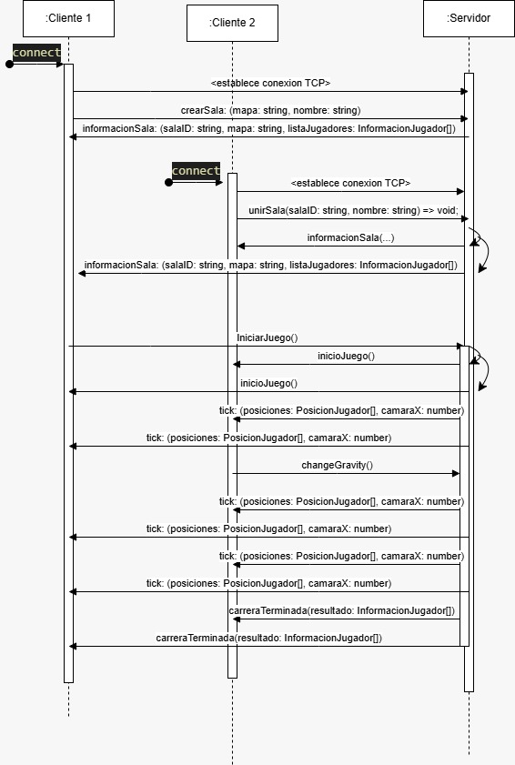
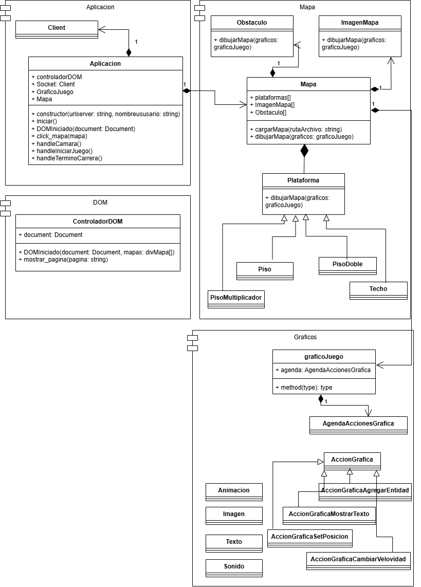

# El pibe gravedad

## Juego

Versión en línea de Gravity Guy, donde los jugadores usan un único botón para cambiar la gravedad. En este juego multijugador, todos compiten en la misma pista visible en la pantalla. El objetivo es evitar obstáculos y no caer fuera del escenario, ya que los jugadores que
se quedan atrapados o caen son eliminados. El ganador será el último jugador que permanezca en la pista o el primero en llegar al final de la misma.

Una pista puede contar con diferentes desafíos, como áreas sin suelo, escalones, plataformas móviles y otros obstáculos que dificulten la carrera. Los jugadores también podrán chocar entre sí, añadiendo una capa extra de dificultad y estrategia.


Trailer del juego original: [Gravity Guy Trailer](https://www.youtube.com/watch?v=iVTqXnJAotQ&ab_channel=Miniclip).

Aunque el juego original ofrece un modo multijugador ("Multiplayer Mode" en el video), el mismo solo funcionaba de forma local, asignando a los distintos jugadores distintas teclas para realizar los movimientos. Por lo tanto, nuestro objetivo principal será crear este modo de forma online en tiempo real Además de darle al juego un estilo visual propio.

## Instrucciones de Juego

Para iniciar el lo podras encontrar en: https://storage.googleapis.com/pibegravedadcliente/index.html

Si es la primera vez que accedes, el sitio te redirigira a la pantalla de configuracion en la que deberás completar tu nombre y modificar la configuración.




De vuelta en la pantalla de inicio, el usuario podra elegir el mapa que desa jugar:



Cuando seleccione uno quedará en un lobby de espera, con la posibilidad de compartir el link con el número de partida para que otros jugadores ingresen. Los otros jugadores pueden ingresar por el link o poniendo el número de sala en el formulario de la parte superior derecha de la pantalla.




Cuando todos los jugadores esten conectados, alguno debe presionar “I” para iniciar el juego.


Los jugadores pueden cambiar la gravedad presionando “G”, los que quedan fuera de la pantalla o se caen (por abajo o por arriba) pierden. El primero en llegar, gana.

## Documentación técnica

El proyecto está dividido en dos componentes principales:

1. El cliente web encargado de mostrar a los jugadores la interfaz gráfica para jugar.
2. El servidor encargado de la lógica del juego y la comunicación entre los distintos clientes.

Para asegurar que todos los jugadores estén sincronizados en tiempo real, el servidor tendrá dos
tareas clave. Primero, se encargará de la lógica de envío y recepción de mensajes entre los clientes,
así como del "motor" del juego que realiza los cálculos de la posición de cada jugador en cada tick.
Planeamos que haya 30 ticks por segundo para mantener el juego fluido.

El cliente, por su parte, recibirá del servidor la posición de la cámara y será responsable de renderizar
el mundo visible en esa área. La cámara se moverá a una velocidad constante, pero el servidor
enviará continuamente la posición de la cámara para evitar descoordinación entre los distintos
clientes y garantizar que todos vean el mismo escenario en tiempo real.

Además del juego en sí, necesitaremos desarrollar toda la lógica para gestionar la experiencia
multijugador. Esto incluye la creación de salas donde los jugadores puedan reunirse, el sistema de
invitaciones para que los amigos puedan unirse a partidas, y la gestión de la entrada y salida de los
jugadores en las partidas. También será importante implementar un sistema para iniciar y finalizar las
partidas, asegurando que todo funcione de manera fluida y sin interrupciones.

## Cliente

El cliente fue desarrollado con Node.js y Vite.js

### Ejecución local

La ejecución local del proyecto es necesario tener instalado `npn` `node.js` y `lint`:

1. Instalar:

    ```bash
    cd cliente
    npm install
    ```

2. Ejecutar
    npm run dev

Para detalles sobre el cliente visita [esta pagina](cliente/README.md).

## Server

Servidor escrito en Golang para el juego "El pibe gravedad".

### Ejecución local con docker (recomendado)

La ejecución local del proyecto es utilizando `docker`:

1. Instala docker y el plugin compose:

    1. En Mac:

        1. Ingresa a la pagina <https://docs.docker.com/desktop/setup/install/mac-install/> para descargar Docker Desktop.
        2. Ejecuta el instalador Docker.dmg y sigue las instrucciones
        3. Ejecuta Docker Desktop
2. Ingresa al directorio del servidor

    ```bash
    cd server/
    ```

3. Ejecuta

    ```bash
    docker compose up
    ```

### Ejecución local directa con go

También es posible ejecutar el servidor de forma local directamente usando `go`:

1. Instala go>1.23.1
   1. En mac:
      1. Descarga el instalador desde <https://go.dev/dl/>.
      2. Ejecuta el instalador y sigue las instrucciones.
2. Ingresa al directorio del servidor

    ```bash
    cd server/
    ```

3. Ejecuta

    ```bash
    go run .
    ```

### Diagrama de clases

El código del servidor está compuesto por las siguientes entidades y relaciones:


(cabe aclarar que Go no es un lenguaje orientado a objetos, por lo que estas entidades son conceptuales y algunas están realmente desarrolladas usando un `struct` con métodos o directamente funciones dentro de un paquete)

- [Room](server/room.go): Representa una sala a la que los jugadores se usen para jugar una partida de **El pibe gravedad**. Está identificada por un `ID` y para jugar el mapa llamado `MapName`. Tiene un `Mutex` para dar sincronización entre los ticks y las modificaciones que pueden hacer los jugadores (por ejemplo el cambio de gravedad). Su propiedad `GameStarted` permite determinar si el juego ya ha comenzado en esta sala, para evitar el ingreso de nuevos jugadores. A la sala se pueden agregar y remover jugadores (`AddPlayer` y `RemovePlayer`), comenzar el juego (`StartGame`) y enviar a todos los jugadores la información de la misma (`sendInformacionSala`).
- [Player](server/player.go): Representa a un jugador que se unió a una sala para jugar. Está identificado por un `ID` y cuenta con un nombre (`Name`). Su propiedad `Socket` es lo que permite recibir y enviar mensajes a ese jugador en especifico: la información de cada tick (`SendTick`), la notificación de que inició el juego (`SendInicioJuego`), la información de la sala (`SendInformacionSala`) y la notificación de la carrera terminó (`SendCarreraTerminada`).
- [Game](server/game.go): Representa el juego siendo desarrollado en una sala. Es donde se encuentra la lógica de los ticks (`gameLoop`), en donde a cada tick se actualiza la partida y se envían los mensajes correspondientes a los jugadores.
- [World](server/world.go): Representa el mundo en el juego tiene lugar. Esta entidad contiene los objetos que se mueven, interactúan y colisionan en el juego: personajes (`Character`), objetos del mapa (`Map`), límites del mundo (utilizados para determinar cuando un jugador muere por hacer contacto con ellos), límite de la cámara (`cameraLimit`, utilizado para determinar cuando un jugador muere por quedar demasiado atrás) y meta de la carrera (`RaceFinish`, utilizado para determinar cuando un jugador pasó la meta).

  La lógica de espacio, posiciones, velocidades y colisiones se realiza utilizando la librería [resolv](http://github.com/solarlune/resolv), siendo toda esta información incluida en su propiedad `space`. Su método `Init` inicializa este espacio con los personajes y los objetos del mapa. El método `Update` es el método que es llamado desde el `Game` en cada tick para que se actualice a un personaje: su posición, sus colisiones y su estado en base a ellas (caminando, muerto, etc.). Además, en base al avance de los jugadores, el `Game` determina la nueva posición de la cámara, por lo que el método `UpdateCameraLimitPosition` actualiza la posición del objeto que representa el límite de la cámara en el mundo.
- [Character](server/character.go): Representa a un personaje, es decir, un jugador (`Player`) dentro del mundo (`World`). El mismo está compuesto por un objeto (`Object`) y una velocidad (`Speed`) dentro del mundo. A su vez, jugada el estado del personaje en la partida: si tiene la gravedad invertida (`HasGravityInverted`, es decir, si el personaje cae hacia arriba en lugar de hacia abajo), si está caminando (`IsWalking`, es decir, si está haciendo contacto con el piso), si está muerto (`IsDead`), si ya ha terminado la carrera (`HasFinished`, es decir, si pasó la meta) y su multiplicador de velocidad (`speedMultiplier`, dada por el multiplicador del sólido con el que esté haciendo contacto). Los personajes pueden aumentar su velocidad (`ScaleSpeed`) e invertir su gravedad (`InvertGravity`).
- [Map](server/map.go): Contiene toda la información que es leída desde el archivo `json` que luego se utiliza para crear el mundo: el alto (`Height`), el ancho (`Width`), las plataformas y obstáculos (`Solids`), los obstáculos mortales (`Fatals`), la posición de inicio de los jugadores (`PlayersStart`) y la posición de la meta (`RaceFinish`). Su método `loadMap` carga toda esta información desde el archivo `json`.
- [Solid](server/map.go): Representa cada uno de los objetos sólidos (no personajes) que el mapa contiene y deben ser creados en el mundo. Están compuestos por sus coordenadas en el mapa y el multiplicador de velocidad que otorgan a los personajes al entrar en contacto con ellos (`SpeedMultiplier`).
- [Coordinates](server/coordinates.go): Representa un conjunto de coordenadas donde un sólido debe ser posicionado en el mundo.

Además, el servidor cuenta con otros dos archivos clave para su funcionamiento:

- [main.go](server/main.go): Punto de entrada de la ejecución del servidor, donde se inicializa el servidor `http` que establece las conexiones con los clientes y crea los web-sockets. El mismo se realiza utilizando la librería standard `net/http` y [`socket.io/v2`](github.com/zishang520/socket.io/v2/socket) (para más detalles consultar la sección [Comunicación cliente-servidor](#comunicación-cliente-servidor))
- [client.go](server/client.go): Archivo donde se encuentran los pasos a seguir para cada uno de los mensajes que son posibles recibir de parte de un cliente:
  - Conexión: crear entidad `Player` que permitirá enviar mensajes a este cliente.
  - Desconexión: remover jugador de la sala (si está en alguna) (`RemovePlayer`) y eliminar la entidad `Player`.
  - Mensaje `crearSala`: crear una entidad `Room`, agregar nueva sala a la lista de salas disponibles y agregar al jugador a esta sala (`AddPlayer`).
  - Mensaje `unirSala`: buscar la sala en la lista de salas disponibles, sacar al jugador de su sala anterior (si estuviera en alguna) (`RemovePlayer`), agregar al jugador a esta sala (`AddPlayer`) y enviar a todos los jugadores de la sala la información de la sala actualizada (`sendInformacionSala`).
  - Mensaje `iniciarJuego`: verificar que el juego no esté ya iniciado y, de lo contrario, iniciar el juego en la sala (`StartGame`).
  - Mensaje `changeGravity`: verificar que el jugador esté en una sala que tiene un juego comenzado y, de ser así, invertir la gravedad de su personaje (`InvertGravity`).

## Comunicación cliente-servidor

La comunicación entre el cliente web y el servidor es vía `http` utilizando web-sockets para poder enviar mensajes en tiempo real. Más específicamente, se utiliza [socket.io](https://socket.io/), que permite el establecimiento de web-sockets de forma sencilla. En el cliente, se utiliza la librería [`socket.io-client`](https://socket.io/docs/v4/client-api/), provista por el propio proveedor y en el servidor la librería [`socket.io/v2`](github.com/zishang520/socket.io/v2/socket), desarrollada por la comunidad.

El protocolo de comunicación se encuentra definido del lado de cliente en el archivo [client_socketio.ts](cliente/src/modelo/client_socketio.ts) de la siguiente forma:

```typescript
interface ServerToClientEvents {
    inicioJuego: () => void;
    tick: (posiciones: PosicionJugador[], camaraX: number) => void;
    carreraTerminada: (resultado: InformacionJugador[]) => void;
    informacionSala: (salaID: string, mapa: string, listaJugadores: InformacionJugador[]) => void;
}

export interface InformacionJugador {
    numeroJugador: number,
    nombre: string,
}

export interface PosicionJugador {
    numeroJugador: number,
    x: number,
    y: number,
    tieneGravedadInvertida: boolean,
    estaCaminando: boolean,
    estado: string,
}

export interface ClientToServerEvents {
    changeGravity: () => void;
    crearSala: (mapa: string, nombre: string) => void;
    unirSala: (salaID: string, nombre: string) => void;
    iniciarJuego: () => void;
}
```

En el servidor, la definición se encuentra distribuida entre los archivos:

- [client.go](server/client.go) en donde mediante el método `On` se establece el comportamiento a ejecutar al recibir un mensaje (`disconnect`, `crearSala`, `unirSala`, `iniciarJuego` y `changeGravity`).
- [player.go](server/player.go) en donde se encuentra la definición de los mensajes que es posible enviar a los jugadores mediante el método `Emit` (`informacionSala`, `inicioJuego`, `tick` y `carreraTerminada`).

El flujo de mensajes entre el cliente y el servidor es el siguiente:



1. Se establece la comunicación entre el cliente 1 y el servidor.
2. La sala es creada mediante el mensaje `crearSala`, incluyendo el nombre del mapa a jugar (`mapa`) y el nombre del jugador (`nombre`).
3. El servidor responde el mensaje `informacionSala` que contiene el identificador de la sala (`salaID`), el nombre del mapa (`mapa`) y la lista de jugadores con su respectivo numero de jugador y nombre (`listaJugadores`) que, obviamente, en este paso solo contiene al jugador que creó la sala.
4. Se establece la comunicación entre el cliente 2 y el servidor.
5. El cliente 2 envía en el mensaje `unirSala`, utilizando el `salaID` que fue enviado al cliente 1 en paso 3 y el nombre de este nuevo jugador (`nombre`).
6. El servidor envía ahora tanto al cliente 1 como al cliente 2 el mensaje `informacionSala`, pero ahora con ambos jugadores en la `listaJugadores`, lo que permitirá a los clientes ver en tiempo real que jugadores ingresan a la sala.
7. El cliente 1 (o el cliente 2) envía el mensaje `iniciarJuego`.
8. El servidor envía a todos los clientes conectados a la sala el mensaje `inicioJuego` para alertar a todos los clientes de que el juego está por comenzar y que deben mostrar el mapa con los personajes.
9. El servidor comienza a enviar el mensaje `tick` de forma periódica, que contiene la información de la posición de todos los jugadores en el mapa (`posiciones`) y la posición de la cámara (`camaraX`), lo que permite que todos los clientes vean exactamente lo mismo en tiempo real.
10. En cualquier momento, el cliente 2 (o el cliente 1) envía el mensaje `changeGravity`.
11. El servidor procesa el mensaje recibido y hace que el personaje del jugador que envió el mensaje invierta su gravedad, lo que se verá reflejado en posición del personaje en los siguientes mensajes `tick`.
12. Cuando el servidor detecta que la carrera terminó (todos los jugadores han muerto o han pasado la meta), envía a todos los jugadores el mensaje `carreraTerminada`, que contiene la posición final en la que terminó cada jugador (primero jugadores según el orden en que llegaron a la meta y luego jugadores en orden inverso al que murieron, es decir, que avanzaron más en la carrera).


## Clases en el cliente

Estos son los modulos y clases del cliente:



La clase aplicacion interfacea todas las logicas del juego: utiliza Client como socket y declara un objeto del tipo ControladorDOM para manejar la interfaz web: clicks en el mapa o en la pantalla de configuracion. Con la clase Mapa levanta el JSON que corresponde y lo dibuja utilizando Graficos, que es la clase con la que encapsulamos a Phaser.js